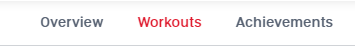
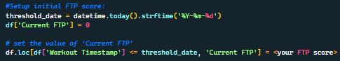
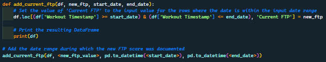

<!-- Improved compatibility of back to top link: See: https://github.com/othneildrew/Best-README-Template/pull/73 -->


<!--
*** Thanks for checking out the Best-README-Template. If you have a suggestion
*** that would make this better, please fork the repo and create a pull request
*** or simply open an issue with the tag "enhancement".
*** Don't forget to give the project a star!
*** Thanks again! Now go create something AMAZING! :D
-->

<!-- PROJECT SHIELDS -->

[![Contributors][contributors-shield]][contributors-url]
[![Forks][forks-shield]][forks-url]
[![Stargazers][stars-shield]][stars-url]
[![Issues][issues-shield]][issues-url]
[![LinkedIn][linkedin-shield]][linkedin-url]

<br />
<div align="center">
  <h3 align="center">Peloton Data ETL</h3>

<p align="center">
    Extract your workout data from your Peloton profile. 
    <br />
    <a href="https://github.com/Nerdosth/Peloton_Data"><strong>Explore the docs »</strong></a>
    <br />
    ·
    <a href="https://github.com/Nerdosth/Peloton_Data/issues">Report Bug</a>
    ·
    <a href="https://github.com/Nerdosth/Peloton_Data/issues">Request Feature</a>
  </p>
</div>

<!-- TABLE OF CONTENTS -->

<details>
  <summary>Table of Contents</summary>
  <ol>
    <li>
      <a href="#about-the-project">About The Project</a>
    </li>
    <li>
      <a href="#getting-started">Getting Started</a>
      <ul>
        <li><a href="#prerequisites">Prerequisites</a></li>
        <li><a href="#installation">Installation</a></li>
      </ul>
    </li>
    <li><a href="#usage">Usage</a></li>
    <li><a href="#contributing">Contributing</a></li>
    <li><a href="#acknowledgments">Acknowledgments</a></li>
  </ol>
</details>

<!-- ABOUT THE PROJECT -->

## About The Project

This script is designed to download, process, and analyze workout data from a Peloton account. It adds new fields that calculates fitness indicators and power zones based on user-provided FTP (Functional Threshold Power) scores and exports the resulting data to a CSV file for further analysis.

I created this script because I wanted to create a dashboard that Peloton doesn't currently offer. I'll use Tableau to start with my initial visuals. Depending on the interest of this project, I will explore more user friendly options.

<p align="right">(<a href="#readme-top">back to top</a>)</p>

<!-- GETTING STARTED -->

## Getting Started

You will need to have some fimilarity with Python.  I am a novice coder and the script has room for improvement.

### Prerequisites

* Python 3.x
* Jupyter Notebook
* pandas
* requests
* Peloton account user ID (on your PC)
  * Log into your account at https://members.onepeloton.com/
  * Click on your profile photo on the top right
  * Click on 'Workouts'</br>
      
  * Right-Click on 'DOWNLOAD WORKOUTS'
    * Copy Link Address
    * Paste link in text file (or wherever you'd like to see the URL)
    * Copy the long code between `user` and `workout_history_csv` example: (91c718c709bf478b937f1c15dba4d3d)
      * This is your `user_id` code used in the Installation steps

### Installation

1. Clone this repository
2. Install the required packages using pip install (pandas, request)
3. Create a 'config.py' file:

   Replace `your_user_id`, `your_username`, and `your_password` with your Peloton account information.

   ```
   user_id = "your_user_id"
   username = "your_username"
   password = "your_password"
   ```
4. ***IMPORTANT***: Add config.py to your gitignore file to ensure you don't upload your account information into your Github repo, especially if it's set to public.

## Usage

1. Using the credentials from the config.py, download your workout file from Peloton's API (unoffical)
2. Modify the data for the purpose of cycling only.
3. Setup the intial FTP score for your data using either option below:
   1. If you've only done one FTP test, you can run this block of code:</br>
     
   3. If you've done multiple FTP test, you can select the date range and apply the FTP score using this block of code:</br>
     

      Copy and paste the last line if you have multiple FTP scores to add. Changing the date and FTP score to fit your data.
   3. Calculate a fitness indicator (Avg. Heartrate/ Avg. Watts ratio), and catogorize workouts with a Power Zones based on Avg. Watts.
   4. Export dataframe to `output_workouts.csv'`

<p align="right">(<a href="#readme-top">back to top</a>)</p>

## Contributing

If you have a suggestion, please fork the repo and create a pull request. You can also simply open an issue with the tag "enhancement".

1. Fork the Project
2. Create your Feature Branch (`git checkout -b feature/AmazingFeature`)
3. Commit your Changes (`git commit -m 'Add some AmazingFeature'`)
4. Push to the Branch (`git push origin feature/AmazingFeature`)
5. Open a Pull Request

<p align="right">(<a href="#readme-top">back to top</a>)</p>

## Acknowledgments

* [Othneil Drew&#39;s README Template](https://github.com/othneildrew/Best-README-Template)

<!-- MARKDOWN LINKS & IMAGES -->

<!-- https://www.markdownguide.org/basic-syntax/#reference-style-links -->

[contributors-shield]: https://img.shields.io/github/contributors/Nerdosth/Peloton_Data.svg?style=for-the-badge
[contributors-url]: https://github.com/othneildrew/Best-README-Template/graphs/contributors
[forks-shield]: https://img.shields.io/github/forks/Nerdosth/Peloton_Data.svg?style=for-the-badge
[forks-url]: https://github.com/Nerdosth/Peloton_Data/network/members
[stars-shield]: https://img.shields.io/github/stars/Nerdosth/Peloton_Data.svg?style=for-the-badge
[stars-url]: https://github.com/Nerdosth/Peloton_Data/stargazers
[issues-shield]: https://img.shields.io/github/issues/Nerdosth/Peloton_Data.svg?style=for-the-badge
[issues-url]: https://github.com/Nerdosth/Peloton_Data/issues
[license-shield]: https://img.shields.io/github/license/Nerdosth/Peloton_Data.svg?style=for-the-badge
[license-url]: https://github.com/Nerdosth/Peloton_Data/blob/master/LICENSE.txt
[linkedin-shield]: https://img.shields.io/badge/-LinkedIn-black.svg?style=for-the-badge&logo=linkedin&colorB=555
[linkedin-url]: https://www.linkedin.com/in/nerdosth
